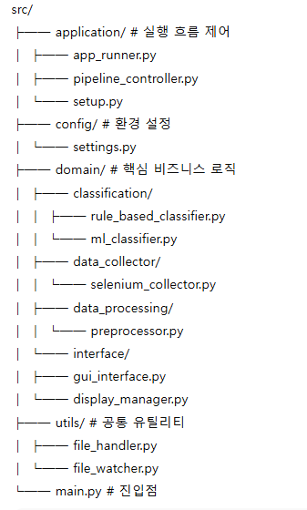

# Jamiron Backend

📂 **Jamiron**은 강의자료(PDF, PPT 등)를 자동으로 **주차별·과목별 폴더로 정리**해주는 스마트 데스크톱 앱입니다.  
이 저장소는 Jamiron의 **백엔드 모듈**을 담고 있으며, 파일 수집·분류·정리와 같은 핵심 로직을 담당합니다.

---

## 🚀 주요 기능
- **강의계획서 자동 수집**: Selenium 기반으로 LMS/포털에서 실라버스 크롤링
- **문서 전처리**: 텍스트 정제, 불필요한 메타데이터 제거
- **자동 분류(Classification)**  
  - Rule-based 방식  
  - 머신러닝 기반 분류기 (Logistic Regression, XGBoost 등)  
  - Weak Supervision & Self-labeling 방식 지원
- **폴더 관리**: 주차별/과목별 디렉토리 생성 및 파일 이동
- **실시간 감시**: 새로운 파일이 추가되면 자동으로 분류 및 정리

---

## 📂 프로젝트 구조


---

## ⚙️ 설치 & 실행

### 1. 저장소 클론
```bash
git clone https://github.com/<your-org>/jamiron-backend.git
cd jamiron-backend
```

### 2. 가상환경 설정
```bash
python -m venv venv
source venv/bin/activate   # macOS/Linux
venv\Scripts\activate      # Windows
```

### 3. 의존성 설치
```
pip install -r requirem ents.txt
```

### 4. 실행
```
python main.py
```

---

## 🧩 개발 환경

* Python 3.11

* Selenium

* PyQt5

* scikit-learn

* Docker (선택)